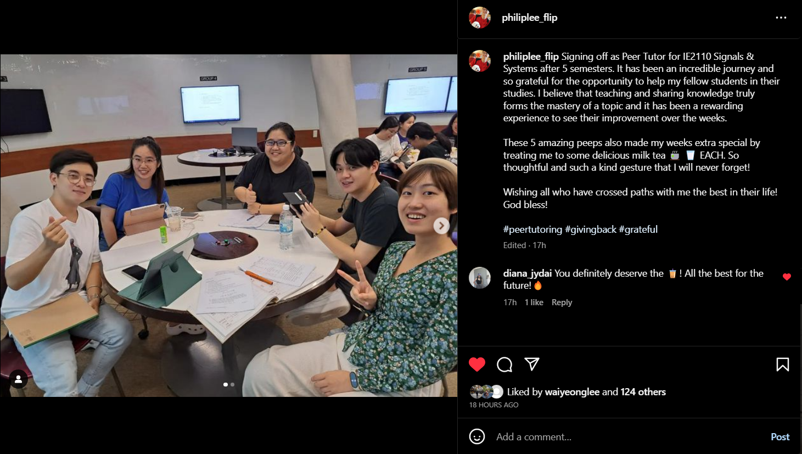
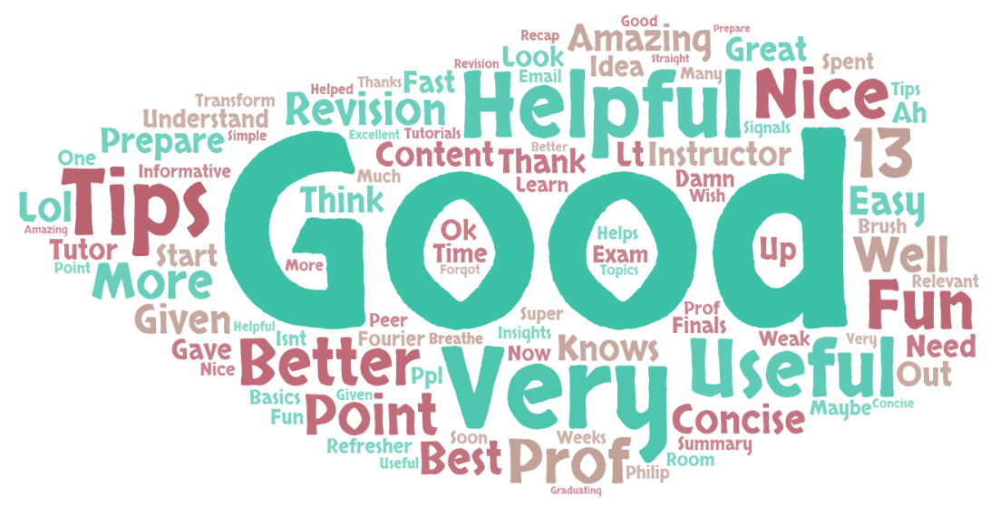

# Signals and Systems Revision Session

Date: Monday, 17 April 2023

 

Peer Tutor for 2.5 years for **Signals and Systems** with content mastery, to guide students in understanding concepts and discussing practice questions.

- Revision slides and cheat sheet are shared freely for anyone to use 😊.
- Averaged *4.76/5.00* rating score from 49 participants' feedback of the revision session.
- Some stellar comments from students are quoted below:
  > "Very useful, tips given were concise and relevant, instructor knows content very well"  
  > "He is a great tutor. Simple and easy to understand. Straight to the point :D (wish he isn't graduating so soon)"

 

### Instagram Appreciation Post

 

### Word Cloud of Student's Feedback

